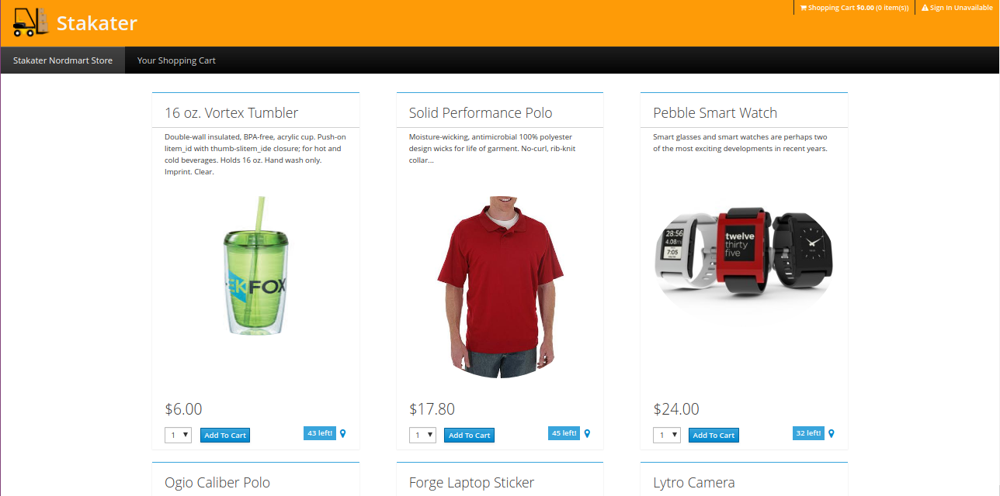
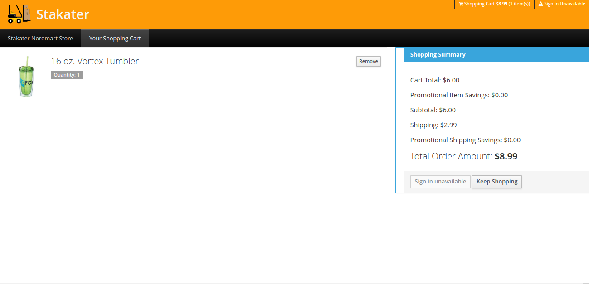
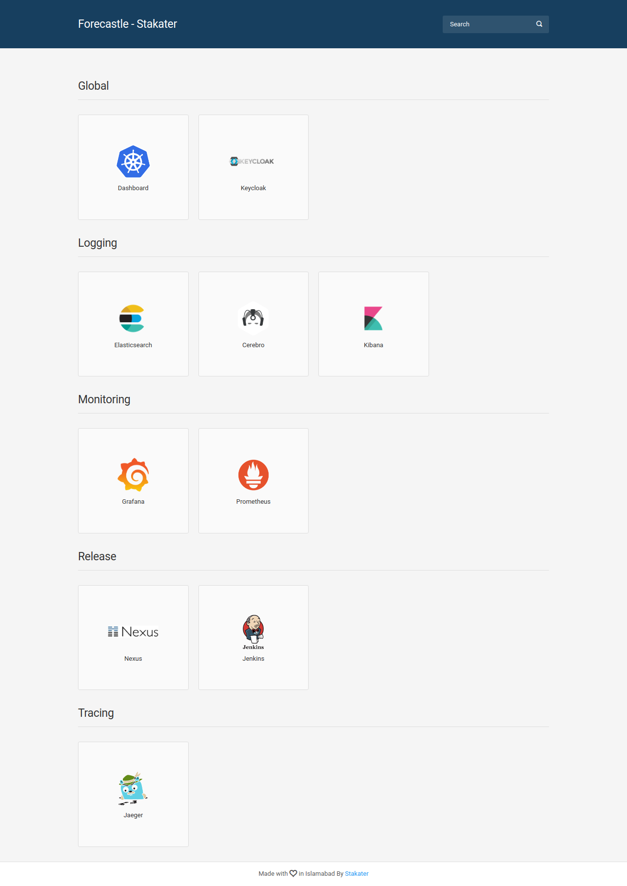

# Stakater-devops-labs

## Overview

The Lab for the DevOps Workshop with Kubernetes and Containers.

## Description

Nordmart is an online store web application built using Spring Boot, WildFly Swarm, Eclipse Vert.x, Node.js and AngularJS adopting the microservices architecture.

* **Web**: A Node.js/Angular front-end. Details can be found on this [link](final/stakater-nordmart-web/README.md)

* **API Gateway**: vert.x service aggregates API calls to back-end services and provides a condenses REST API for front-end. Details can be found on this [link](final/stakater-nordmart-gateway/README.md)

* **Catalog**: Spring Boot service exposing REST API for the product catalog and product information. Details can be found on this [link](final/stakater-nordmart-catalog/README.md).

* **Inventory**: WildFly Swarm service exposing REST API for product's inventory status. Details can be found on this [link](final/stakater-nordmart-inventory/README.md)

* **Cart**: Spring Boot service exposing REST API for shopping cart. Details can be found on this [link](final/stakater-nordmart-cart/README.md)

## Architecture

The diagram given below shows architecture of the application.

```text
                              +-------------+
                              |             |
                              |     Web     |
                              |             |
                              |   Node.js   |
                              |  AngularJS  |
                              +------+------+
                                     |
                                     v
                              +------+------+
                              |             |
                              | API Gateway |
                              |             |
                              |   Vert.x    |
                              |             |
                              +------+------+
                                     |
                 +---------+---------+-------------------+
                 v                   v                   v
          +------+------+     +------+------+     +------+------+
          |             |     |             |     |             |
          |   Catalog   |     |  Inventory  |     |     Cart    |
          |             |     |             |     |             |
          | Spring Boot |     |WildFly Swarm|     | Spring Boot |
          |             |     |             |     |             |
          +------+------+     +-------------+     +-------------+
                 |                                       |
                 v                                       v
          +------+------+                         +------+------+
          |             |                         |             |
          |    MySQL    |                         |    MySQL    |
          |             |                         |             |
          +-------------+                         +-------------+
```

## Views

The app contains two main screens.

* First one is the home screen which lists all the products. It fetches all the products from catalog and their available stock value from inventory and displays them. You can add an item to the cart using the respective `Add To Cart` button.

  

* Second is the cart screen which shows the items currently in your cost and their cost.

  

## Monitoring

Dasbhoards given below can be used to monitor application by configuring them in Monitoring stack. If monitoring stack is not already configured use guidelines given in this [link](https://playbook.stakater.com/content/processes/bootstrapping/deploying-stack-on-azure.html) to configure it.

* JVM metrics dashboard can be configured using this [config](https://github.com/stakater/StakaterKubeHelmMonitoring/blob/azure-capability/manifests/grafanaDashboards/jvm.yaml).

  

* Catalog service metrics dashboard can be configured using this [config](https://github.com/stakater-lab/nordmart-dev-apps/blob/master/releases/catalog-service-dashboard.yaml).

  

## Deployment

### Kubernetes

#### Pre Requisites

* A working Kubernetes cluster.
* A Jenkins server. You can run one locally by executing

  ```bash
  docker run -u root --rm -d -p 8080:8080 -p 50000:50000 -v jenkins-data:/var/jenkins_home -v /var/run/docker.sock:/var/run/docker.sock jenkinsci/blueocean
  ```

* Deploy Stakater Stacks(Global, Logging, Monitoring, Release, Tracing) by following [this guide](https://playbook.stakater.com/content/processes/bootstrapping/deploying-stack-on-azure.html).
Once the stacks are deployed and running you can use [Forecastle](https://github.com/stakater/forecastle), which is automatically installed by Global stack, to see all the apps installed in the cluster i.e 

* We already have separate repositories for the different microservices in the `stakater-lab` organization with the prefix `stakater-nordmart-`. Similarly there are other repositories for [dev-tools](https://github.com/stakater-lab/nordmart-dev-tools), [dev-apps](https://github.com/stakater-lab/nordmart-dev-apps) and [prod-apps](https://github.com/stakater-lab/nordmart-prod-apps) which you will need. You can either use them for demo or fork your own repositories.
To enable CI/CD for these apps, create a new pipeline by following the steps below
  * Go to New Item -> Github Organization and select git credentials from drop down and set owner to `stakater-lab` or the name of your organization.

  * Add following things in the projects section:
    * filter by name (with regular expression) and behaviour should be Repositories. with the following expression stakater-nordmart.* (if you follow the same naming convention as followed in `stakater-lab`)
    * Advance clone behaviours with default setting

  * In the Automatic branch project triggering section add this regular expression (PR-\d+|master).

  * Once all the configuration are done look at the Scan Organization log console to make sure that only pipeline for apps run and no other pipeline run.

#### GitOps - Dev Stack

In the dev stack, you can deploy using GitOps via flux. To install flux, run the `dev-tools` pipeline created above.

Once the pipeline is run, get the ssh key of flux by executing

```bash
kubectl -n nordmart-dev logs deployment/flux-nordmart-dev | grep identity.pub | cut -d '"' -f2
```

 and add it to the `dev-apps` repository on github.

Flux will start watching the repository and will automatically apply any changes in the repository on the cluster. It will also keep a watch for new images and update the stack and repo when a new version of image becomes available.

So as soon as you push to master branch of an app e.g cart, Jenkins will push the image to nexus and flux will update the deployment automatically.

#### CI Ops - Prod Stack

In production stack, we use CI Ops so whenever you wish to update an app, go to `prod-apps` repository and update the docker image version of the respective app in the respective `*-release` file. When you create the pull request for this change, Jenkins will verify the change by executing `dry-run` functionality. If it succeeds then you can merge the pull request. Once this change gets merged to `master` branch Jenkins will re-run the pipeline and update the deployment in prod stack.
